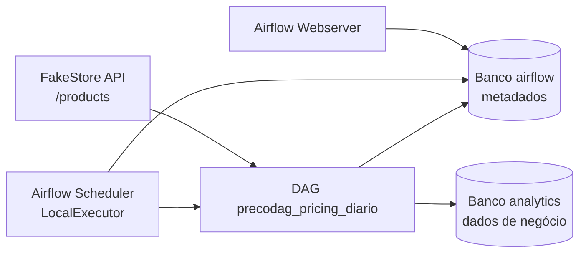
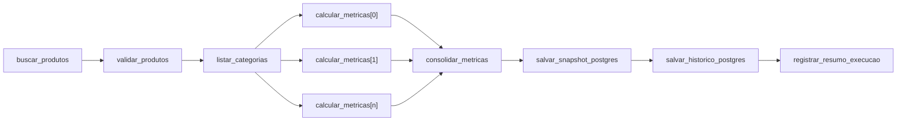

# Arquitetura técnica do `precodag`

## Identificação acadêmica

- **Disciplina:** Orquestração de Workflows
- **Curso:** Engenharia de Inteligência Artificial e MLOps Online
- **Professor:** Reinaldo Carlos Mendes
- **Atividade:** Atividade 01 — Airflow
- **Projeto:** `precodag`

## Visão geral

O `precodag` substitui o agendamento isolado por cron por uma DAG observável no
Apache Airflow. A solução consulta a FakeStore API, valida produtos, descobre
categorias dinamicamente, calcula métricas em paralelo e persiste dois modelos
de dados no PostgreSQL analítico: snapshot idempotente e histórico append.



O ambiente local usa Docker Compose, Apache Airflow 2.9.3 com Python 3.11,
`LocalExecutor` e PostgreSQL 15. Os bancos `airflow` e `analytics` estão no mesmo
servidor PostgreSQL, porém permanecem logicamente separados.

## Componentes de infraestrutura

### PostgreSQL

O serviço `postgres` inicia dois bancos:

- `airflow`: Metadata Database usada internamente pelo Airflow;
- `analytics`: destino das métricas de pricing da ShopBrasil.

O arquivo `sql/init.sql`, montado no diretório de inicialização da imagem
PostgreSQL, cria o banco analítico, suas tabelas, restrições e índices na
primeira criação do volume.

### Airflow Init

O serviço transitório `airflow-init` executa, em ordem:

1. migração do banco de metadados;
2. criação do usuário acadêmico local;
3. criação ou atualização do pool `ecommerce_pool`;
4. substituição segura da Connection `postgres_analytics`.

Após essa preparação, o serviço termina. Ele não participa das execuções
regulares da DAG.

### Scheduler

O Scheduler interpreta `schedule="0 6 * * *"`, considera o timezone
`America/Sao_Paulo`, cria DAG runs e agenda task instances quando suas
dependências são satisfeitas. Também controla:

- retries e atraso exponencial;
- callbacks de ciclo de vida;
- limites do pool;
- expansão dinâmica das tasks;
- estados e dependências de cada execução.

### Webserver

O Webserver expõe a interface em `http://localhost:8080`. Por ela, o operador
pode remover a pausa da DAG, iniciar uma execução manual e consultar grafo,
Grid View, tentativas, duração e logs.

### Executor e worker

O ambiente usa `LocalExecutor`. Não existe um container worker dedicado: o
Scheduler coordena processos locais para executar as tasks. Essa configuração
permite paralelismo adequado à atividade acadêmica sem introduzir broker,
Celery workers ou cluster Kubernetes.

Em uma implantação distribuída, o executor poderia ser substituído por
CeleryExecutor ou KubernetesExecutor. Essa expansão não está implementada no
projeto atual.

### Metadata Database

O banco `airflow` armazena o estado operacional da plataforma:

- DAG runs e task instances;
- XComs;
- usuários e permissões;
- pools;
- connections;
- histórico de tentativas e agendamentos.

Esse banco não é um repositório de métricas de negócio. Separar metadados de
orquestração e dados analíticos reduz acoplamento e torna claro qual componente
é responsável por cada informação.

### PostgreSQL analítico

O banco `analytics` recebe os resultados por meio do `PostgresHook` e da
Connection `postgres_analytics`. Ele contém:

- `metricas_categoria_snapshot`, com uma linha por data e categoria;
- `metricas_categoria_historico`, com novas linhas a cada execução.

## Fonte externa

A fonte de dados é exclusivamente a FakeStore API:

```text
GET https://fakestoreapi.com/products
```

A task `buscar_produtos` define timeout de 20 segundos, valida o status HTTP e
confere se o JSON retornado é uma lista. Falhas de rede, HTTP ou payload são
registradas e relançadas para o Airflow.

## Definição da DAG

A DAG `precodag_pricing_diario` é declarada com `@dag`. O agendamento possui:

- cron `0 6 * * *`;
- timezone `America/Sao_Paulo` criado com `pendulum`;
- `start_date` explícito em 1º de janeiro de 2026;
- `catchup=False`, que impede backfill automático desde a data inicial.

As funções de processamento usam `@task`. Seus retornos geram XComArgs e
estabelecem dependências quando são passados às tasks seguintes.

## Fluxo e topologias



O desenho demonstra três topologias:

- **linear:** `buscar_produtos -> validar_produtos -> listar_categorias`;
- **fan-out:** uma instância mapeada de cálculo para cada categoria;
- **fan-in:** todas as instâncias mapeadas convergem em
  `consolidar_metricas`.

## TaskGroups

Três TaskGroups organizam a visualização e a responsabilidade das etapas:

| TaskGroup | Responsabilidade |
|---|---|
| `grupo_ingestao` | Buscar e validar os produtos. |
| `grupo_analise` | Descobrir categorias, calcular métricas e consolidar resultados. |
| `grupo_persistencia` | Gravar snapshot, histórico e resumo operacional. |

TaskGroup não executa trabalho e não altera a semântica das dependências. Ele
estrutura a DAG visual e logicamente.

## Operador customizado

`ValidarProdutosOperator` herda de `BaseOperator`. Ele valida, para cada
produto:

- presença de `id`;
- `title` textual e não vazio;
- `price` numérico e maior ou igual a zero;
- `category` textual e não vazia.

O operador retorna a lista validada para as tasks seguintes por XCom.

## XComs

O fluxo utiliza retornos automáticos para transportar:

- lista de produtos;
- categorias;
- métricas por categoria;
- lista consolidada;
- contagens de linhas persistidas;
- resumo da execução.

Esse desenho é compatível com o pequeno conjunto didático da FakeStore API. Em
uma carga de alto volume, o pipeline deveria persistir os dados em storage ou
banco e transportar por XCom somente uma referência ao conjunto.

## Dynamic Task Mapping

As categorias são extraídas do payload e não estão hardcoded. O trecho
`.partial(produtos=...).expand(categoria=categorias)` mantém fixa a lista de
produtos e varia a categoria. O Scheduler resolve a quantidade de instâncias
somente durante a execução, depois que `listar_categorias` termina.

Essa abordagem permite que uma nova categoria seja processada sem alteração de
código e materializa o fan-out no Grid View do Airflow.

## Pool e concorrência

Cada instância de `calcular_metricas_por_categoria` usa o pool
`ecommerce_pool`. O pool possui 2 slots, portanto no máximo duas instâncias
mapeadas desse conjunto ocupam o recurso simultaneamente.

O pool controla capacidade, não dependência. As tasks continuam independentes,
mas aguardam um slot quando o limite está ocupado.

## Retries e exponential backoff

A task de ingestão possui 3 retries, atraso inicial de 5 minutos e
`retry_exponential_backoff=True`. O intervalo cresce entre as tentativas,
reduzindo chamadas repetidas durante uma indisponibilidade temporária da API.

O bloco `try/except` registra a exceção e executa `raise`. Sem esse novo `raise`,
o Airflow interpretaria a task como concluída e não aplicaria o retry.

## Callbacks

Os callbacks `ao_falhar`, `ao_tentar_novamente` e `ao_sucesso` são associados à
task crítica. Eles recebem o contexto do Airflow e registram DAG, task e data
lógica nos logs.

Os registros simulam alertas operacionais. Não existe envio real para Slack,
e-mail ou outra plataforma externa.

## Persistência e consistência

As duas tasks de persistência utilizam `PostgresHook` com
`postgres_conn_id="postgres_analytics"`. Os registros são enviados em lote por
`executemany` e confirmados explicitamente com `commit`.

A dependência entre `salvar_snapshot_postgres` e
`salvar_historico_postgres` garante a ordem de gravação. Se o snapshot falhar,
o histórico não é executado nessa DAG run.

## Idempotência

`metricas_categoria_snapshot` possui `UNIQUE (data_referencia, categoria)`. A
task de snapshot executa:

```sql
ON CONFLICT (data_referencia, categoria)
DO UPDATE SET ...
```

Uma nova execução para a mesma data e categoria atualiza a linha existente. A
quantidade de linhas do snapshot não cresce por repetição da mesma chave.

`metricas_categoria_historico` não possui essa restrição composta e usa insert
append. Ela cresce em cada execução bem-sucedida, oferecendo rastreabilidade da
evolução dos valores.

## Por que Airflow substitui cron neste cenário

O cron define quando um comando começa, mas não modela nativamente o workflow
com suas dependências e estados. No `precodag`, o Airflow acrescenta:

- representação explícita da DAG;
- logs e histórico por task instance;
- retries com backoff exponencial;
- callbacks de falha, retry e sucesso;
- paralelismo dinâmico por categoria;
- limitação de concorrência por pool;
- inspeção de XComs e resultados;
- reprocessamento controlado;
- separação visual por TaskGroups.

Esses mecanismos tratam diretamente as falhas silenciosas, a baixa
observabilidade, a manutenção manual de categorias e os riscos de
reprocessamento existentes na rotina por cron.
